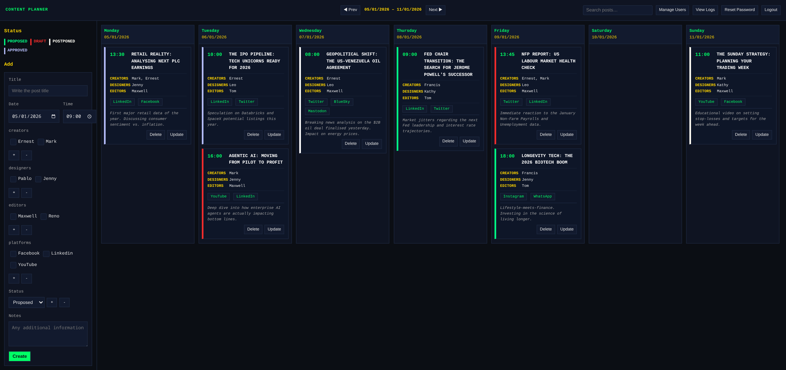

# Content Planner

A streamlined web application for managing content creation schedules. This tool allows teams to plan and follow the content production cycle across various platforms.

<p align="center">
  
</p>

## Licence and copyright

Copyright (C) 2025-2026 **Francesco Ugolini**

This program is free software: you can redistribute it and/or modify it under the terms of the **GNU Affero General Public License (AGPL-3.0)** as published by the Free Software Foundation, either version 3 of the License, or (at your option) any later version.

This project is released with the intent that all improvements and derivative works remain open source. If you host a modified version of this software on a server for others to use, you **must** make your modified source code available to those users.

## Getting started

### Prerequisites

-   **Node.js** (v18.0.0 or higher)
-   **npm** (usually bundled with Node)

### Installation

1. **Clone the repository:**

    ```bash
    git clone https://github.com/[your-username]/content-planner.git
    cd content-planner
    ```

2. **Setup Backend:**

    ```bash
    cd backend
    npm install
    node server.js
    ```

3. **Setup Frontend:**
  
    Open a new terminal window:

    ```bash
    cd frontend
    npm install
    npm run dev
    ```

4. **Build for Production:**
  
    To create an optimised production build of the frontend:

    ```bash
    cd frontend
    npm run build
    ```

## Initial configuration and security

### First-time sign-in (Bootstrap)

To ensure maximum security, this application **does not have a default password**. 

1. **Start the server:** Run `node server.js` inside the `backend` directory.
2. **Retrieve credentials:** On the very first run, the server generates a **unique, one-time temporary password** and prints it to the terminal/console.
3. **Sign-in:** Use the username `admin` and the generated password from your terminal.
4. **Mandatory Reset:** The system will immediately prompt you to change this password. Access to the dashboard is blocked until a robust password is set.

**SECURITY WARNING:** If you lose the terminal output before signing in for the first time, you must delete the `backend/db/users.json` file and restart the server to generate a new bootstrap password.

### Account lockout and sessions

- The server enforces a temporary 15-minute lockout after five failed login attempts.
- Active sessions are stored in `backend/db/sessions.json`. While this allows sessions to survive server restarts, administrators can revoke all active sessions for a specific user via the management interface if a breach is suspected.

### CORS and cookies

-   To allow browsers to send the `session_token` cookie across origins, set the `CORS_ALLOWED_ORIGINS` environment variable to a comma-separated list of allowed origins (for example `http://localhost:5173`). The server will then allow credentials and set `Access-Control-Allow-Credentials` accordingly.

-   In development the server defaults to allowing `http://localhost:5173` with credentials enabled. In production, always set `CORS_ALLOWED_ORIGINS` to your exact frontend origin(s).

### User management

Once logged in as an administrator, use the **Manage Users** button in the header to:

-   Provision new users.
-   Assign roles (user or admin).
-   Set temporary passwords for new users.

## Features

-   Updates are seen in real time across all clients, using bidirectional event-driven communication to ensure data is always current.
-   Includes write-through caching and lock-free reads with versioning.
-   A dashboard of scheduled posts across seven days.
-   Monitor the progress of post creation.
-   Content management tailored for specific social platforms.
-   Logs and tools to find specific content.
-   Export data for external use with custom filters.

## Technical architecture and performance

To maintain speed and reliability as data grows, the following optimisations have been implemented:

-   The system maintains cache integrity without needing to re-read the entire file for every change.
-   Ensures data consistency by updating the cache and the permanent store simultaneously.
-   Uses versioning to allow data to be read without blocking, improving concurrent access performance.
-   Sorting is performed only during write operations, making read requests significantly faster.
-   Includes memory limits and streaming capabilities to handle very large files without crashing the server.

## CSV export

Download posts as CSV with optional filtering via query parameters:

```
GET /api/export/csv?dateFrom=2026-01-01&dateTo=2026-01-31&status=Proposed
```

**Query Parameters:**

-   `dateFrom` (optional): Start date in YYYY-MM-DD format
-   `dateTo` (optional): End date in YYYY-MM-DD format
-   `status` (optional): Filter by status value (e.g., "Proposed", "Approved", "Published")

**Example Usage:**

-   All posts: `GET /api/export/csv`
-   By date range: `GET /api/export/csv?dateFrom=2026-01-01&dateTo=2026-01-31`
-   By status: `GET /api/export/csv?status=Published`
-   Combined: `GET /api/export/csv?dateFrom=2026-01-01&dateTo=2026-01-31&status=Approved`

The CSV includes columns for ID, Title, Date, Time, Status, Creators, Designers, Editors, Platforms, and Notes.

## Project structure

-   `/frontend`: React application built with Vite.
-   `/backend`: Node.js/Express server using an optimised flat-file JSON storage system.
-   `/backend/db`: Contains `posts.json`, `lists.json`, and `users.json`. **Note:** Ensure this directory is backed up regularly.

## Disclaimer

**THIS SOFTWARE IS PROVIDED "AS IS", WITHOUT WARRANTY OF ANY KIND.** The authors and copyright holders shall not be liable for any claim, damages, or other liability, whether in an action of contract, tort, or otherwise, arising from, out of, or in connection with the software or the use or other dealings in the software. Specifically, the authors are not responsible for security breaches resulting from the failure to change default credentials.
