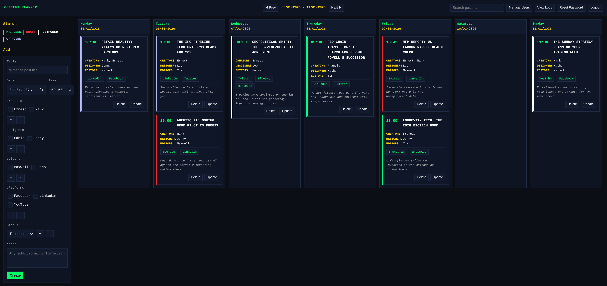

# Content Planner

A streamlined web application for managing content creation schedules. This tool allows teams to plan and follow the content production cycle across various platforms.

<p align="center">
  
</p>

## Licence & Copyright

Copyright (C) 2025-2026 **Francesco Ugolini**

This program is free software: you can redistribute it and/or modify it under the terms of the **GNU Affero General Public License (AGPL-3.0)** as published by the Free Software Foundation, either version 3 of the License, or (at your option) any later version.

This project is released with the intent that all improvements and derivative works remain open source. If you host a modified version of this software on a server for others to use, you **must** make your modified source code available to those users.

## Getting Started

### Prerequisites

- **Node.js** (v18.0.0 or higher)
- **npm** (usually bundled with Node)

### Installation

1. **Clone the repository:**

```bash
git clone https://github.com/[your-username]/content-planner.git
cd content-planner

```

2. **Setup Backend:**

```bash
cd backend
npm install
node server.js

```

3. **Setup Frontend:**
   Open a new terminal window:

```bash
cd frontend
npm install
npm run dev

```

## Initial Configuration & Security

### First-time sign-in

On first run the system creates a default administrator account. Use these credentials to sign in:

- **Username:** `admin`
- **Password:** `Welcome123!`

**SECURITY WARNING:** You will be prompted to change this password on first sign-in. This is mandatory — choose a robust password.

### CORS and cookies

- To allow browsers to send the `session_token` cookie across origins, set the `CORS_ALLOWED_ORIGINS` environment variable to a comma-separated list of allowed origins (for example `http://localhost:5173`). The server will then allow credentials and set `Access-Control-Allow-Credentials` accordingly.

- In development the server defaults to allowing `http://localhost:5173` with credentials enabled. In production, always set `CORS_ALLOWED_ORIGINS` to your exact frontend origin(s).

### Account lockout & sessions

- The server tracks failed login attempts and enforces a temporary lockout after repeated failures (after five failed attempts the account is locked for 15 minutes).

- Sessions are persisted to `backend/db/sessions.json` so active sessions survive server restarts until expiry (default 24 hours). Admins can revoke sessions via `/api/users/:username/revoke-sessions` if needed.

### User Management

Once logged in as an administrator, use the **Manage Users** button in the header to:

- Provision new users.
- Assign roles (user or admin).
- Set temporary passwords for new users.

## Features

- An overview of scheduled posts across seven days.
- Tracking of post statuses.
- Platform-specific content planning.
- Activity logging.
- Filtering.
- CSV export API.

## CSV Export

Download posts as CSV with optional filtering via query parameters:

```
GET /api/export/csv?dateFrom=2026-01-01&dateTo=2026-01-31&status=Proposed
```

**Query Parameters:**
- `dateFrom` (optional): Start date in YYYY-MM-DD format
- `dateTo` (optional): End date in YYYY-MM-DD format  
- `status` (optional): Filter by status value (e.g., "Proposed", "Approved", "Published")

**Example Usage:**
- All posts: `GET /api/export/csv`
- By date range: `GET /api/export/csv?dateFrom=2026-01-01&dateTo=2026-01-31`
- By status: `GET /api/export/csv?status=Published`
- Combined: `GET /api/export/csv?dateFrom=2026-01-01&dateTo=2026-01-31&status=Approved`

The CSV includes columns for ID, Title, Date, Time, Status, Creators, Designers, Editors, Platforms, and Notes.

## Project Structure

- `/frontend`: React application built with Vite.
- `/backend`: Node.js/Express server using flat-file JSON storage (no external database required).
- `/backend/db`: Contains `posts.json`, `lists.json`, and `users.json`. **Note:** Ensure this directory is backed up regularly.

## Disclaimer

**THIS SOFTWARE IS PROVIDED "AS IS", WITHOUT WARRANTY OF ANY KIND.** The authors and copyright holders shall not be liable for any claim, damages, or other liability, whether in an action of contract, tort, or otherwise, arising from, out of, or in connection with the software or the use or other dealings in the software. Specifically, the authors are not responsible for security breaches resulting from the failure to change default credentials.

